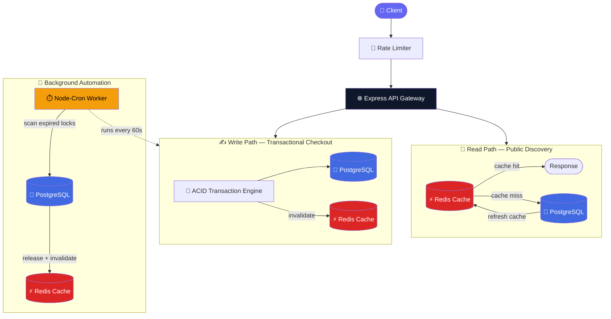
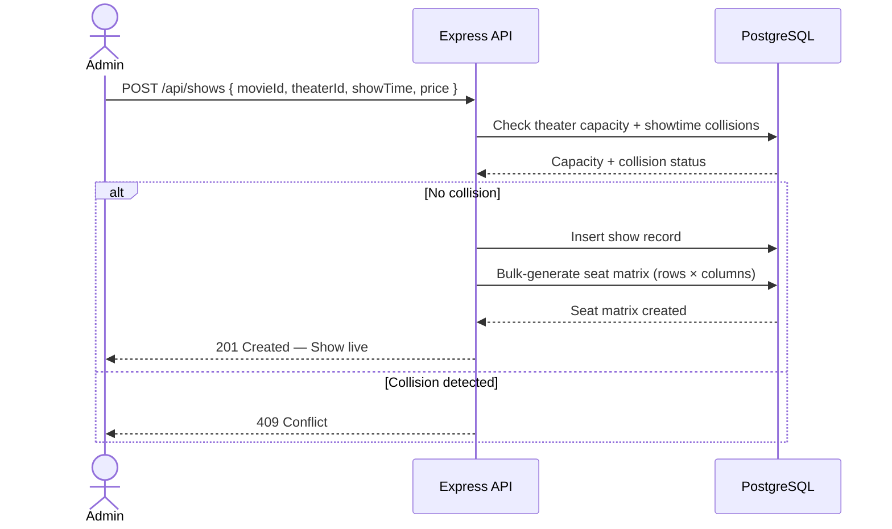
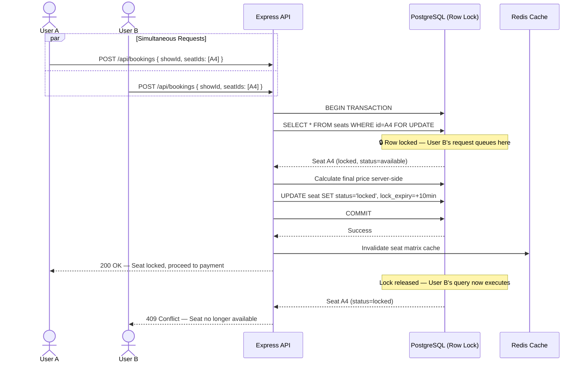
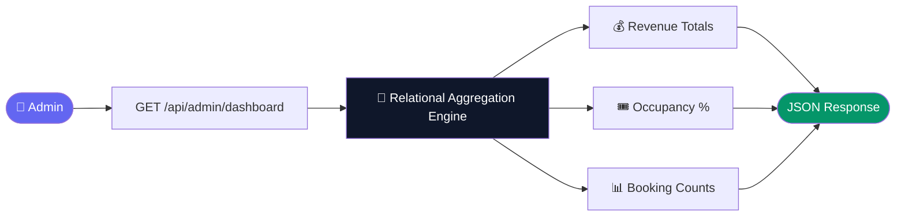
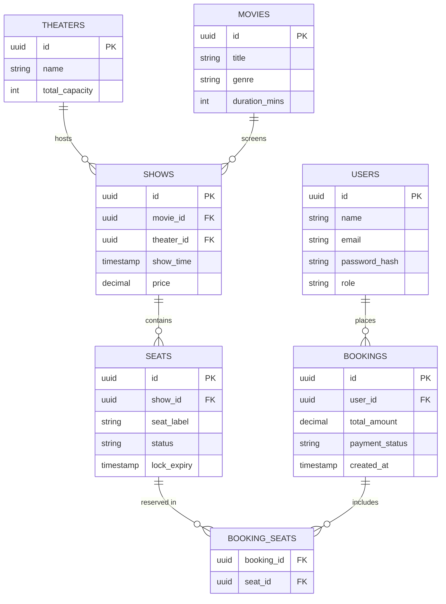
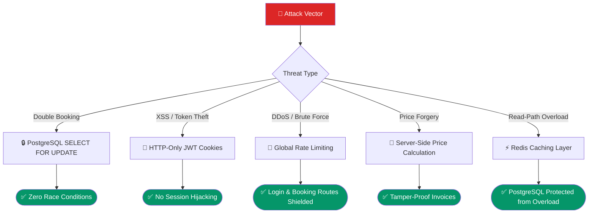
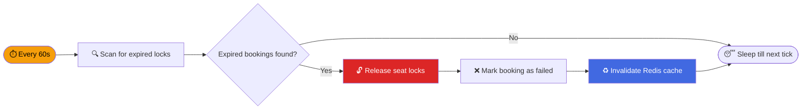
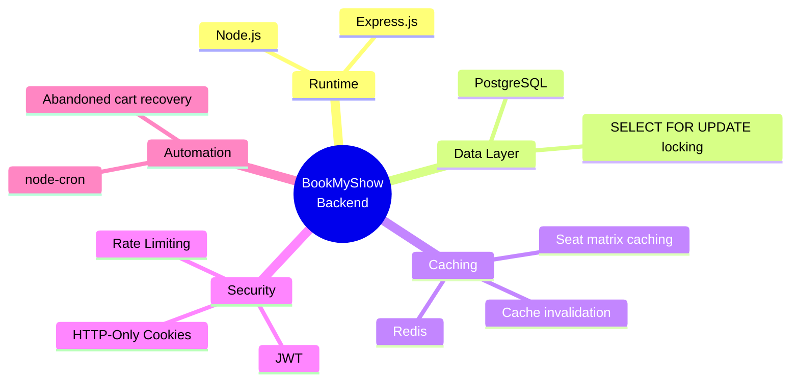

<div align="center">

# 🎬 BookMyShow Backend

### A highly scalable, concurrent, and fault-tolerant movie ticket booking engine

*Solving double-bookings, high-traffic read spikes, and abandoned cart recovery — at scale.*

[](https://nodejs.org/)
[](https://expressjs.com/)
[](https://www.postgresql.org/)
[](https://redis.io/)
[](https://jwt.io/)

**Author:** Chirabrata Ghosal

</div>

---

## 📖 Table of Contents

- [Why This Project Exists](#-why-this-project-exists)
- [Key Engineering Features](#-key-engineering-features)
- [System Architecture](#️-system-architecture)
- [Core Workflows](#-core-operational-workflows)
- [Database Schema (ERD)](#-database-schema-erd)
- [Security & Attack Prevention](#️-enterprise-security--attack-prevention)
- [API Documentation](#-api-endpoint-documentation)
- [Background Automation](#️-background-automation-cron-jobs)
- [Tech Stack](#-tech-stack)
- [Getting Started](#-getting-started)

---

## 💡 Why This Project Exists

Ticket booking systems look simple until two users try to book **seat A4** in the same second. This backend is a deep-dive into the concurrency, caching, and fault-tolerance problems that make real-world booking platforms (BookMyShow, Ticketmaster, IRCTC) hard to build correctly.

---

## 🚀 Key Engineering Features

| Feature | What It Solves |
|---|---|
| 🔒 **Concurrency Shield** | `SELECT FOR UPDATE` row-level locking → guarantees **zero double-bookings** |
| ⚡ **High-Performance Caching** | Redis-backed seat matrices → single-digit ms read latency |
| 🛡️ **Zero-Trust Security** | JWTs in HTTP-Only cookies → immune to XSS token theft |
| 🤖 **Self-Healing Automation** | `node-cron` worker auto-releases abandoned carts after 10 min |
| 🎭 **Dynamic Capacity Spawning** | Auto-generates seat matrices instantly on showtime creation |

---

## 🏗️ System Architecture

The system splits **heavy reads** from **critical writes** to keep PostgreSQL from becoming a bottleneck under traffic spikes.



---

## ⚙️ Core Operational Workflows

### 1. 🎭 The Seat Spawning Engine



### 2. 💳 The Transactional Checkout (ACID + Concurrency Shield)

This is the core engineering challenge: preventing two users from booking the same seat simultaneously.



### 3. 📈 The Dashboard Analytics Engine



---

## 🗃️ Database Schema (ERD)



---

## 🛡️ Enterprise Security & Attack Prevention



| Threat | Mitigation |
|---|---|
| **Race Conditions (Double Booking)** | PostgreSQL explicit row-level locking on simultaneous checkout requests |
| **XSS (Cross-Site Scripting)** | JWTs stored exclusively in HTTP-Only cookies |
| **DDoS & Brute Force** | Global rate limiting on login and booking routes |
| **Payload Tampering (Price Forgery)** | Invoice totals calculated server-side from DB-backed pricing rules |
| **Resource Exhaustion** | Redis shields high-read seat matrix endpoints from PostgreSQL overload |

---

## 🗺️ API Endpoint Documentation

### 👤 Authentication & Users

| Method | Endpoint | Body | Action |
|---|---|---|---|
| `POST` | `/api/auth/register` | `name`, `email`, `password`, `role` | Registers a user and creates a secure profile |
| `POST` | `/api/auth/login` | `email`, `password` | Validates credentials and issues an HTTP-Only JWT cookie |

### 🏢 Inventory Management (Admin Only)

| Method | Endpoint | Body | Action |
|---|---|---|---|
| `POST` | `/api/movies` | — | Registers a new film entity |
| `POST` | `/api/theaters` | — | Registers a physical theater and defines max capacity |
| `POST` | `/api/shows` | `movieId`, `theaterId`, `showTime`, `price` | Validates collisions, saves showtime, spawns seat matrix |

### 🎟️ Public Discovery (Redis Cached)

| Method | Endpoint | Action |
|---|---|---|
| `GET` | `/api/shows/:id/seats` | Returns complete seat layout and availability statuses |

### 💳 Transaction Engine (Concurrency Shielded)

| Method | Endpoint | Body | Action |
|---|---|---|---|
| `POST` | `/api/bookings` | `showId`, `seatIds` | Locks seats, calculates total, creates pending booking |
| `POST` | `/api/bookings/process-payment` | `bookingId`, `paymentSuccess` | Confirms/cancels booking, updates seat availability |

### 📈 Business Analytics (Admin Only)

| Method | Endpoint | Action |
|---|---|---|
| `GET` | `/api/admin/dashboard` | Calculates revenue, booking counts, occupancy metrics |

---

## ⏱️ Background Automation (Cron Jobs)

A self-healing worker built with `node-cron` prevents seats from staying locked forever when a user abandons checkout.



| Property | Detail |
|---|---|
| **Schedule** | Runs every 60 seconds |
| **Task** | Scans DB for pending bookings whose locks have expired |
| **Execution** | Releases expired seat locks → marks booking as failed → invalidates Redis cache |

---

## 🧰 Tech Stack



---

## 🏁 Getting Started

```bash
# Clone the repository
git clone <your-repo-url>
cd bookmyshow-backend

# Install dependencies
npm install

# Set up environment variables
cp .env.example .env
# Fill in DATABASE_URL, REDIS_URL, JWT_SECRET, PORT

# Run database migrations
npm run migrate

# Start the server
npm run dev
```

### Required Environment Variables

| Variable | Description |
|---|---|
| `DATABASE_URL` | PostgreSQL connection string |
| `REDIS_URL` | Redis connection string |
| `JWT_SECRET` | Secret key for signing JWTs |
| `PORT` | Server port (default: `5000`) |

---

<div align="center">

Built with a focus on **concurrency correctness** and **real-world booking-system engineering**.

**Chirabrata Ghosal**

</div>
